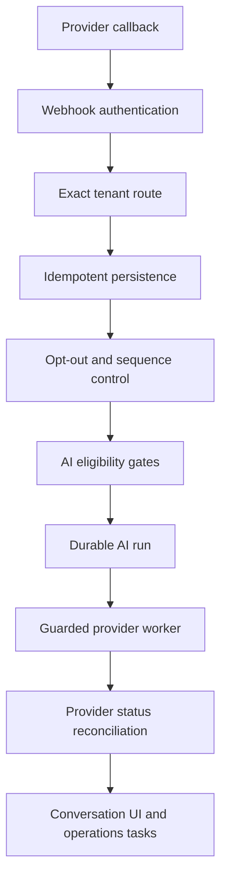

# RealtyTechAI messaging reliability and launch-readiness report

Evidence date: August 7, 2026 UTC  
Audited baseline: `9bef669` on `main`  
Status: code-controlled work complete; no production deployment or live client message was performed

## Executive outcome

The SendGrid inbound 401 was reproduced to its actual application cause and fixed. The bearer token endpoint was working. After token authentication and exact tenant routing succeeded, the inbound service incorrectly reused the tenant's outbound SendGrid `connected/error` state as an authorization requirement. A newly assigned tenant starts disconnected until its outbound test completes, and a failed test retains an error, so valid inbound mail was rejected as HTTP 401 even though the webhook credential was valid.

The controller also returned the service promise without awaiting it. As a result, its local `try/catch` could not observe asynchronous rejections. The controller now awaits the webhook service before returning.

The completed change set also adds durable provider-state reconciliation, conservative retries, duplicate recovery, AI failure escalation, exact sender/routing readiness, automatic webhook test evidence, stale-approval invalidation, clearer inbox states, and operator-visible next actions. Automated tests use mocked providers and do not send real client messages.

## Pull-request stack

Review in this order. Every PR is a draft and remains unmerged.

| PR | Branch | Scope |
| --- | --- | --- |
| [#42](https://github.com/0nlyNET/real-estate-automation-platform-/pull/42) | `agent/sendgrid-inbound-auth-root-cause` | Urgent SendGrid inbound 401, awaited controller error handling, authenticated multipart regression test |
| [#43](https://github.com/0nlyNET/real-estate-automation-platform-/pull/43) | `agent/messaging-ai-reliability` | Email/SMS delivery, idempotency, provider callbacks, AI recovery, conversation UI, full mocked E2E |
| [#44](https://github.com/0nlyNET/real-estate-automation-platform-/pull/44) | `agent/client-readiness-observability` | Exact readiness, automatic test evidence, stale-evidence invalidation, operator diagnostics, dependency remediation, this report |

No PR was merged. No deployment, DNS change, provider-account change, client activation, or global-pause change was performed.

## Root-cause report

| Area | Actual root cause | Resolution |
| --- | --- | --- |
| SendGrid inbound 401 | Inbound authentication succeeded, then the service threw `UnauthorizedException` when the tenant's **outbound** SendGrid integration was disconnected or carried a test error. Assignment intentionally starts `connected: false`, so inbound routing could deadlock behind outbound readiness. | Webhook authentication, exact tenant routing, and outbound-send availability are separate decisions. Authenticated inbound mail is stored and routed even when outbound SendGrid needs attention; outbound unavailability is logged safely and handled by the normal AI/send gates. |
| Asynchronous webhook errors | The controller returned `handleSendGridInbound(...)` from inside `try/catch` without `await`; later promise rejection bypassed the catch and its structured diagnostic. | Controller methods are async and await the service promise before returning. |
| Tenant email routing | Readiness accepted a generic connected flag and did not prove that the credential routing key, inbound address, approved sender, Reply-To, from name, and provider payload agreed exactly. | Runtime-readiness requires all exact fields and equality checks. SendGrid assignment requires a unique inbound address and sender name. |
| Outbound email identity | Some paths could lose the tenant sender name, Reply-To, subject, or provider threading context. | Every tenant email uses its configured from name/address and exact inbound Reply-To; subject, `In-Reply-To`, and provider IDs are persisted. |
| Delivery truth | SendGrid API acceptance was not reconciled with later processed/delivered/bounce/drop/block events. | Added authenticated, deduplicated SendGrid Event Webhook persistence and monotonic message-state reconciliation. |
| Retry safety | Provider failures did not consistently distinguish a definitive rejection from an ambiguous network result. Retrying an ambiguous result can duplicate a message the provider already accepted. | Only definitive 408/429/5xx responses receive bounded retries. Ambiguous results are never automatically resubmitted; the message fails visibly and creates human work. |
| Provider correlation | Provider IDs were not consistently saved, and an accepted response without an ID could appear complete. | Twilio SIDs and SendGrid message IDs are stored. Missing provider IDs are visible as `PROVIDER_ID_MISSING` and create an operations task. |
| Manual SMS | Manual SMS could bypass the guarded delivery worker and its consent, pause, ownership, retry, and state handling. | Manual SMS is queued through the same guarded worker as other outbound messages. |
| Duplicate inbound delivery | A crash after inbound persistence but before AI enqueue could cause a provider retry to be deduplicated without recovering the eligible AI work. | Duplicate SendGrid/Twilio deliveries find the original message and re-enter idempotent AI acceptance; the unique AI run prevents duplicate processing. |
| Opt-outs | Opt-out intent had to be guaranteed before any sequence stop/AI decision, including provider retries whose body could differ. | Stored authoritative STOP/unsubscribe state is used on replay; opt-out is applied before AI and no AI response is created. |
| AI exhaustion | A run could exhaust attempts without a durable founder-visible action. | Exhausted/failed AI runs are marked failed, move the conversation to human review, and create a deduplicated operations task. |
| Conversation visibility | Inbox data required manual refresh and did not represent provider acceptance, AI processing, pauses, or human review clearly. | Shared/assigned views, tenant-scoped read access, polling, read-only shared threads, and explicit queued/processing/accepted/sent/delivered/failed/paused/human-review states were added. |
| Readiness false positives | A default time zone counted as configured without confirmation; any booking URL counted without current verification; provider checks used only connected/last-sync. | Readiness now requires verified time zone, currently verified HTTPS booking link, exact runtime provider fields, exact approved identity, and exact inbound routing. |
| Missing readiness evidence | There was no inbound-email evidence field, and a blind UI button could stamp provider-failure visibility without an observed failure. | Authenticated successful inbound email/SMS, STOP, and provider-failure callbacks record evidence automatically. Manual backfill requires a reference. |
| Stale launch approvals | Sender, routing, time-zone, booking, or onboarding changes could leave old tests and approvals looking current. | Material changes invalidate the affected tests, provider evidence, client approval, and operator approval. A configuration timestamp makes freshness part of readiness. |
| Dependency audit | Frontend lockfile resolved PostCSS 8.5.19, within the advisory range through 8.5.22. npm initially reported no automatic fix even though a patched registry release existed. | Direct PostCSS constraint and lockfile updated to 8.5.26; final frontend production audit reports zero vulnerabilities. |

## End-to-end architecture

Webhook authentication is provider-specific: SendGrid inbound/event callbacks use the configured OAuth bearer credential; Twilio inbound/status callbacks use the exact configured callback URL, tenant auth token, and Twilio signature. Authentication occurs before mutation.

Tenant routing is exact: email uses the normalized envelope recipient and unique SendGrid routing key; SMS uses the normalized inbound `To` number, with the configured messaging-service identifier only as an additional match. Ambiguous or unknown matches are not assigned across tenants.

Persistence is authoritative: provider delivery IDs and internal idempotency keys prevent repeated callbacks or worker retries from creating duplicate conversation messages. Inbound messages, sequence cancellation, lead events, and opt-outs commit before AI is considered.

AI is fail-closed: global pause, tenant lifecycle/automation, billing entitlement, quiet hours, channel consent, opt-out, conversation mode, ownership, human takeover, approved configuration, and policy checks all remain in force. A blocked or failed AI run becomes an explicit state/task rather than a silent drop.

## Workflow behavior

### Outbound email

1. Resolve the exact tenant and lead.
2. Recheck entitlement, consent, pause, ownership, and message safety.
3. Persist one queued message with tenant branding, subject, Reply-To, and threading metadata.
4. Claim it with a lease and mark provider submission started.
5. Submit through the tenant SendGrid payload and save the provider ID/accepted state.
6. Reconcile authenticated SendGrid delivery events monotonically.
7. On a definitive transient rejection, retry at most the bounded limit. On an ambiguous result, do not resubmit; fail visibly and open human work.

### Inbound email

1. Verify bearer authorization before tenant mutation.
2. Normalize the multipart envelope recipient and route only by the exact unique inbound address.
3. Deduplicate the provider message ID.
4. Match the sender to one tenant lead or safely create the tenant lead where allowed; ambiguous routing is never guessed.
5. Persist the inbound message in the lead's conversation.
6. Apply unsubscribe/opt-out before any AI action and stop the sequence.
7. Record authenticated inbound readiness evidence.
8. Queue one idempotent AI run only when the conversation remains eligible.

### Inbound SMS

1. Route by exact inbound number and verify the Twilio signature against the configured URL/token.
2. Deduplicate `MessageSid` and preserve an authoritative stored opt-out result.
3. Match only within the routed tenant; unknown/ambiguous senders create review work after authenticated storage.
4. Process STOP before AI, revoke consent, cancel unsent work, and record automatic readiness evidence.
5. For a normal reply, stop the active sequence and idempotently queue eligible AI.

### AI response

1. Load the tenant, lead, listing/business knowledge, message history, conversation control, and policy context.
2. Run preflight eligibility and the final send-time guard.
3. Generate only for an allowed classification and supported context.
4. Persist the AI response in the same conversation before provider dispatch.
5. Send through the correct tenant provider worker and reconcile delivery state.
6. Escalate uncertainty, unsupported requests, policy blocks, provider ambiguity, or exhausted attempts to human review.

## Automated test evidence

All provider calls in automated tests are mocks or in-process test doubles.

| Required command | Final result |
| --- | --- |
| `cd backend && npm ci --cache /tmp/rta-backend-npm-cache --prefer-online` | Passed |
| `cd backend && npm run lint` | Passed, 0 errors |
| `cd backend && npm test -- --runInBand` | Passed: 76/76 suites, 314/314 tests, 0 snapshots |
| `cd backend && npm run build` | Passed |
| `cd backend && npm audit --omit=dev` | Passed: 0 vulnerabilities |
| `cd frontend && npm ci --cache /tmp/rta-frontend-npm-cache --prefer-online` | Passed: 500 packages installed from lockfile |
| `cd frontend && npm run lint` | Passed: 0 errors, 47 existing warnings |
| `cd frontend && npm test` | Passed: readiness/static-link and admin-routing suites; 33 static links checked |
| `cd frontend && npm run build` | Passed: TypeScript compiled and 46 pages generated |
| `cd frontend && npm audit --omit=dev` | Passed: 0 vulnerabilities after PostCSS 8.5.26 lockfile update |

### Coverage map

| Requirement | Automated evidence |
| --- | --- |
| SendGrid token issuance, credential expiry, invalid credentials, header variations, real HTTP multipart inbound | `sendgrid-inbound-oauth.spec.ts`, `sendgrid-inbound-http.e2e.spec.ts`, `webhooks.controller.spec.ts` |
| Exact tenant route, unknown sender, lead match/create, persistence, visibility, sequence stop, AI queue, duplicates, email unsubscribe | `webhooks.sendgrid.spec.ts`, `messaging-ai-email.e2e.spec.ts` |
| AI pauses, ownership, human takeover, eligibility, response persistence, exhaustion | `ai-conversation-control.service.spec.ts`, `ai-conversation.service.spec.ts`, `messaging-ai-email.e2e.spec.ts` |
| Twilio signature, exact routing, STOP, duplicate callback recovery, status callbacks | `webhooks.twilio-safety.spec.ts`, `webhooks.status.spec.ts`, `telephony.controller.spec.ts` |
| Provider rejection, safe retry, ambiguous result, provider IDs | `providers.spec.ts`, `messaging.service.spec.ts`, `webhooks.sendgrid-events.spec.ts`, `webhooks.status.spec.ts` |
| Full outbound email → reply → authenticated inbound → tenant/lead/conversation → sequence stop → AI → correct provider → stored response → delivered status | `messaging-ai-email.e2e.spec.ts` |
| Readiness exact fields, stale-evidence invalidation, automatic webhook evidence, migration compatibility | `onboarding.service.spec.ts`, `settings.service.spec.ts`, `production-schema-reconciliation.spec.ts` |
| Inbox and readiness state/controls | frontend readiness and admin-routing scripts plus production TypeScript build |

## Outside-provider and live-environment blockers

The repository cannot determine these statuses without authorized provider/environment access. They must be verified before claiming live readiness:

- Twilio number ownership and the applicable Trust Hub, A2P 10DLC, toll-free, or regional sender approval.
- Twilio legal business identity/name verification and exact production inbound/status callback configuration.
- SendGrid verified sender identity or authenticated domain and the required DNS records.
- SendGrid Inbound Parse destination, OAuth client configuration, and Event Webhook destination in the provider account.
- Valid production provider credentials supplied through the secure admin interface.
- A controlled live test using only Jayden-owned test phone/email identities; no client recipients.
- Production database migration/backup checkpoint, deployment approval, and post-deploy health verification.
- Counsel/client approval of consent language, source authorization, opt-out process, fair-housing-reviewed copy, and sender identity.

No assertion is made that Twilio SMS or SendGrid email is live-ready until the applicable rows above have retained evidence in the product.

## Information Jayden must provide manually

- Client legal and public business names, market/service area, and account/billing/operations/support/approval/escalation contacts.
- Enabled channels, lead sources, expected volume, reporting frequency, target launch date, routing rules, business hours, quiet hours/time zone, escalation behavior, and follow-up timing.
- Approved brand/team name, sender name, phone identity, email identity, message signature/voice, and verified booking link when booking is enabled.
- Exact consent disclosure, collection method, source ownership, consent version/evidence process, opt-out process, purchased/cold-list exclusion, and fair-housing acknowledgement.
- Provider account owner/authorization plus credentials entered only through the secure admin interface; never in logs, chat, source, or PR comments.
- Assigned Twilio number and unique SendGrid from address/name/inbound Reply-To, plus provider approval/verification references.
- Jayden-owned controlled test phone/email recipients and retained test/failure references.
- Client written launch approval reference, billing verification, and Jayden's final platform launch decision.

## Launch-readiness checklist

### Code complete

- [x] SendGrid 401 root cause fixed without weakening authentication.
- [x] Async webhook exceptions are awaited and logged safely.
- [x] Exact email/SMS tenant routing and provider correlation.
- [x] Idempotent inbound/event processing and duplicate AI-enqueue recovery.
- [x] Consent, opt-out, pause, ownership, quiet-hour, and safety gates retained.
- [x] Bounded definitive-rejection retry and no retry for ambiguous submissions.
- [x] AI/provider failures create human-review state and operations work.
- [x] Conversation UI shows processing and delivery states without database inspection.
- [x] Readiness validates actual runtime fields and invalidates stale evidence.
- [x] Database migrations are additive and schema-reconciliation tests pass.
- [x] Production dependency audits are clean.

### Automated tests complete

- [x] Backend full serial Jest suite.
- [x] Frontend configured tests and static-link/readiness checks.
- [x] Backend/frontend lint and production builds.
- [x] Mocked full email/reply/AI/provider-status E2E.
- [x] OAuth, multipart, invalid/expired auth, duplicate, opt-out, STOP, signature, callback, rejection, and retry cases.

### Controlled live test required

- [ ] Production-like SendGrid token refresh and multipart inbound reply using a controlled mailbox.
- [ ] Correct tenant branding, Reply-To, thread persistence, AI eligibility, outbound response, and delivery event in one controlled email journey.
- [ ] Twilio outbound/inbound/status/STOP journey using a controlled phone.
- [ ] Provider rejection visibility and operations-task creation.
- [ ] Shared/assigned inbox updates and human takeover in the deployed UI.

### External provider approval required

- [ ] Applicable Twilio sender/Trust Hub/A2P approval reference recorded.
- [ ] SendGrid sender/domain verification reference recorded.
- [ ] Exact provider webhook endpoints authorized and verified.

### Client information required

- [ ] Every client-owned readiness item listed above is complete in the product.
- [ ] Consent/source/fair-housing evidence is retained.
- [ ] Written approval references the exact final setup.

### Explicit owner/deployment approval required

- [ ] Jayden reviews the draft PR stack.
- [ ] Backup/migration/deployment plan is approved outside this task.
- [ ] The global automation pause is changed only in the explicitly approved launch window.
- [ ] The client is activated only by the authorized owner after every readiness blocker is clear.

## Exact next action for Jayden

Review the stacked draft change set beginning with PR #42 and either approve it for a controlled nonproduction deployment or leave requested changes. Do not activate a client or change the global automation pause during that review.
